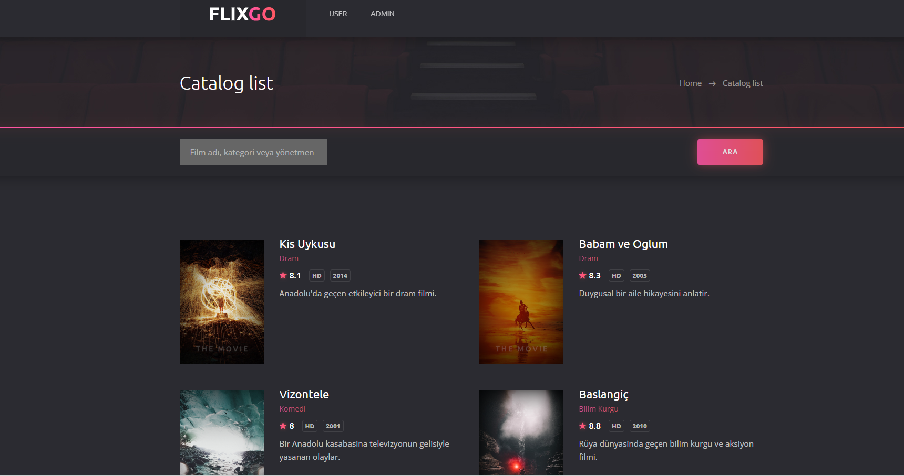
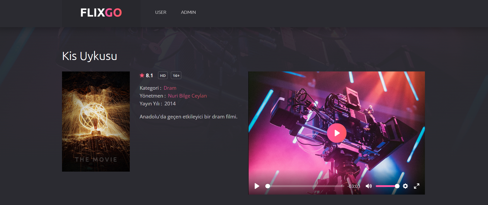
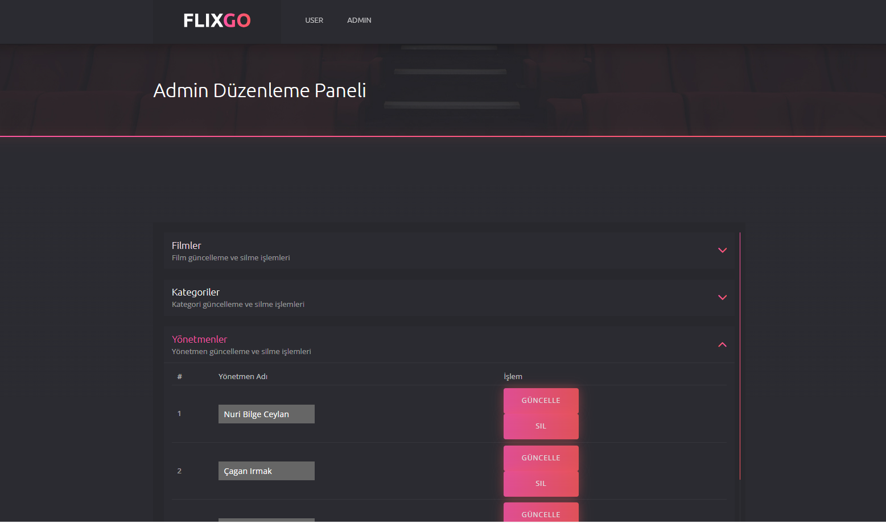
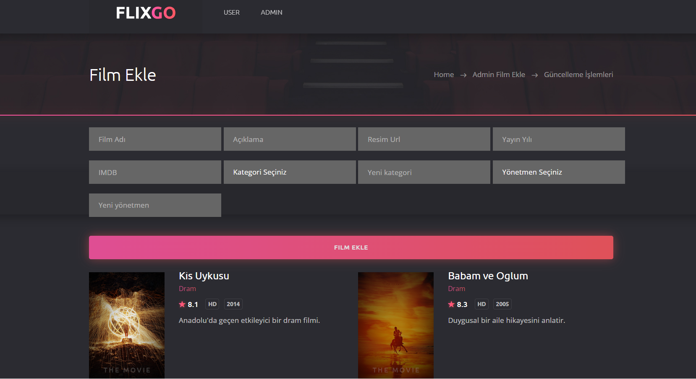

<!-- HEADER -->

<div align="center">

# 🎬 FlixGo Movie

### Modern Movie Management System with ASP.NET Core MVC & Entity Framework Core

A modern movie management application built using ASP.NET Core MVC, Entity Framework Core, SQL Server and Bootstrap. The project includes movie management, category management, director management, responsive user interface, admin dashboard and JSON-based movie listing.

---


</div>

---

# 📸 Project Screenshots

## Home Page



---

## Movie Detail



---

## Admin Dashboard



---


## Movie Managment



---


# 🚀 Project Features

### 🎥 User Side

* Home Page
* Movie Listing
* Movie Categories
* Movie Details
* Responsive Design
* Dynamic Movie Cards

---

### 🛠 Admin Panel

* Dashboard
* Movie CRUD
* Category CRUD
* Director CRUD
* Movie Search
* JSON Data Listing

---

### 📊 Dashboard

* Total Movies
* Total Categories
* Total Directors
* Average IMDB Score
* Highest Rated Movie
* Latest Added Movies

---

# 🏗 Project Architecture

```text
FlixGoMovie

│

└── ASP.NET Core MVC

    ├── Entity Framework Core

    ├── SQL Server

    ├── Bootstrap 5

    ├── Razor Views

    ├── LINQ

    ├── JSON

    └── MVC Pattern
```

---

# 🛠 Technologies

| Backend          | Frontend    | Database   | Other                 |
| ---------------- | ----------- | ---------- | --------------------- |
| ASP.NET Core MVC | Bootstrap 5 | SQL Server | Entity Framework Core |
| C#               | HTML5       | Code First | LINQ                  |
| Razor Views      | CSS3        | Migration  | JSON                  |
| MVC Pattern      | JavaScript  |            | Responsive Design     |

---

# 📊 Modules

✔ Home Page

✔ Movie Listing

✔ Movie Details

✔ Dashboard

✔ Movie Management

✔ Category Management

✔ Director Management

✔ Movie Search

✔ JSON Movie Listing

✔ Responsive Admin Panel

---

# 📂 Database Tables

| Table      |
| ---------- |
| Movies     |
| Categories |
| Directors  |

---

# 🎯 Learning Outcomes

* ASP.NET Core MVC
* Entity Framework Core
* Code First Approach
* SQL Server
* LINQ Queries
* CRUD Operations
* JSON Serialization
* Bootstrap Dashboard Design
* Responsive Web Design

---

# ⭐ Project Status

✅ Completed

---

<div align="center">

Made with ❤️ using ASP.NET Core MVC

</div>
